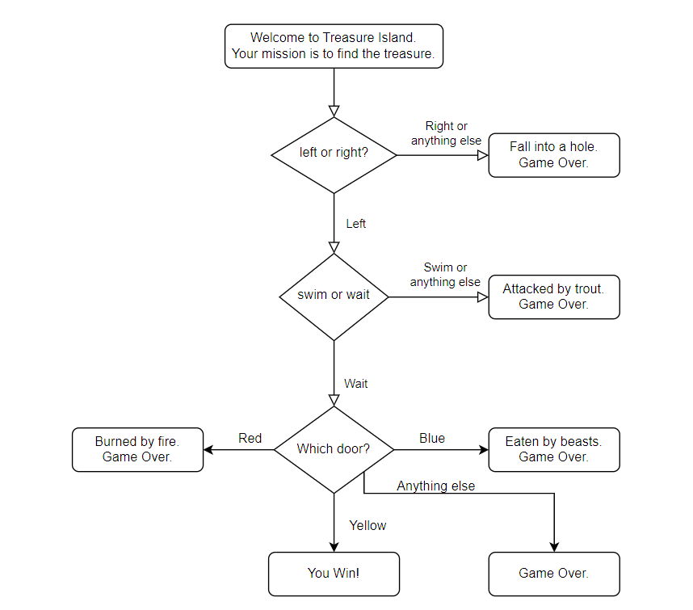

# 🏝️ Day 03 - Treasure Island Game

## 📌 Project Description

This project is a fun and interactive **"Choose Your Own Adventure"** style text game, where users make decisions that determine the outcome of their journey to find a hidden treasure.

The story progresses based on user input, using conditional logic to create multiple paths and endings.

This is the third project from the **100 Days of Code: Python Bootcamp by Angela Yu**, focused on deepening your understanding of Python conditionals.

---

## 🎯 What I Learned

- Writing conditional logic using `if`, `else`, and `elif`
- Nesting `if` statements to create decision trees
- Using `input()` and `.lower()` to handle user choices
- Building interactive text-based programs

---

## 🗺️ Game Flowchart

The game's logic follows a flowchart-based decision tree.



---

## 🛠 How to Run

Make sure you have Python installed. Then run the script in your terminal:

```bash
python main.py
